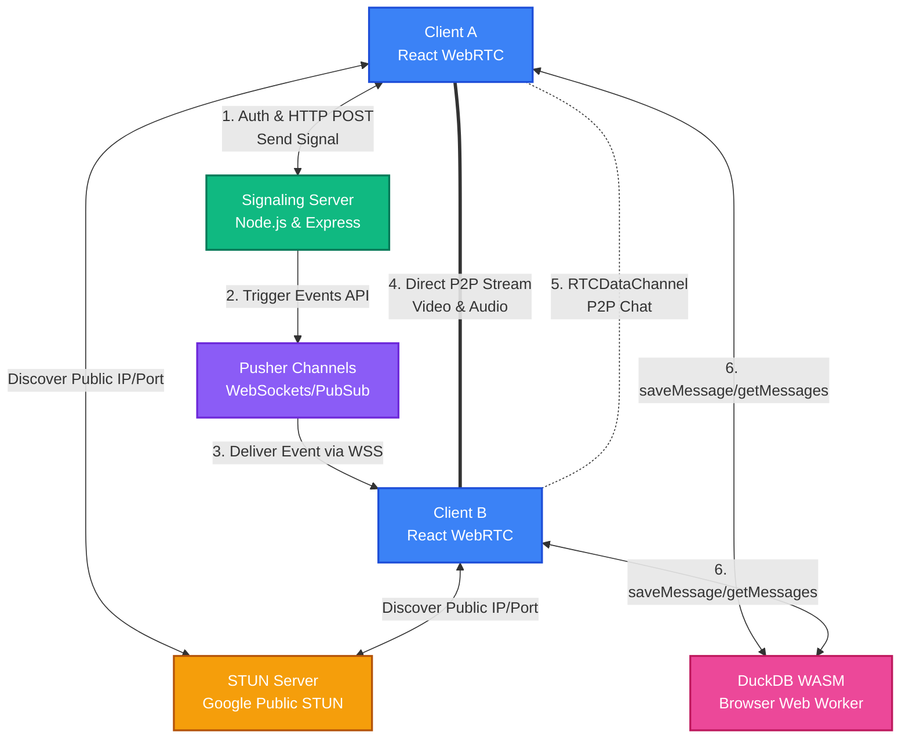

# WebRTC Serverless Signaling Architecture & P2P Chat

This repository contains a full-stack WebRTC application featuring a React client and a NodeJS/Express signaling server optimized for serverless/stateless deployment using [Pusher](https://pusher.com/). It also demonstrates completely decentralized P2P text chat and local-first data storage via **WebRTC Data Channels** and **DuckDB WASM**.

## Architecture Overview

Traditional WebRTC signaling relies on stateful WebSocket servers (like Socket.io). This architecture uses **Pusher** to handle the persistent WebSocket connections externally, allowing the backend Signaling Server to remain completely stateless.

For real-time text chat, it bypasses the signaling layer entirely, leveraging **WebRTC Data Channels** to broadcast messages in a true peer-to-peer fashion. Message history is seamlessly cached and queried directly in the browser via **DuckDB WASM** without interacting with any remote database.

## Signaling & Chat Flow

1. **Authentication & Discovery**
    - A client connects to the web app and joins a room.
    - It authenticates via the Signaling Server (`/api/pusher/auth`) and connects to a Pusher `presence` channel.
    - Other users in the room are discovered automatically via Pusher presence events.

2. **WebRTC Signaling Exchange**
    - When a new participant joins, existing participants generate a WebRTC Offer. They also initialize a WebRTC Data Channel (`RTCDataChannel`) designated for 'chat'.
    - They send this Offer using a simple `HTTP POST` to the Signaling Server (`/api/signal`).
    - The server triggers a Pusher private event directed at the target user.
    - The target user receives the Offer, generates an Answer, bind their incoming datachannel events, and sends it back.
    - ICE candidates are discovered via Google's STUN server and magically exchanged through the HTTP -> Pusher pipeline.

3. **Peer-to-Peer Media & Data**
    - Once the SDP (Session Description Protocol) Offers/Answers and ICE candidates are exchanged, a direct Peer-to-Peer (P2P) WebRTC connection is established.
    - **Audio & Video:** Flows efficiently between clients directly.
    - **Text Chat:** Flows over `RTCDataChannel`. This provides lower latency messaging and reduces dependencies on cloud-messaging services like Pusher avoiding higher costs and payload limits.

4. **Local Execution with DuckDB WASM**
    - Instead of hosting complex and laggy backend databases for chat histories, client applications run an embedded **DuckDB WebAssembly** thread. 
    - Text messages transmitted over DataChannels are sequentially deposited into a locally-bootstrapped DuckDB table via Arrow data bindings. Queries are incredibly performant, securing an excellent Local-First UX.

## Project Structure

- `/webrtc_client` - The frontend application (React, Vite, Pusher-JS, DuckDB Wasm)
- `/webrtc_server` - The stateless signaling backend (Node.js, Express, Pusher Server SDK)
