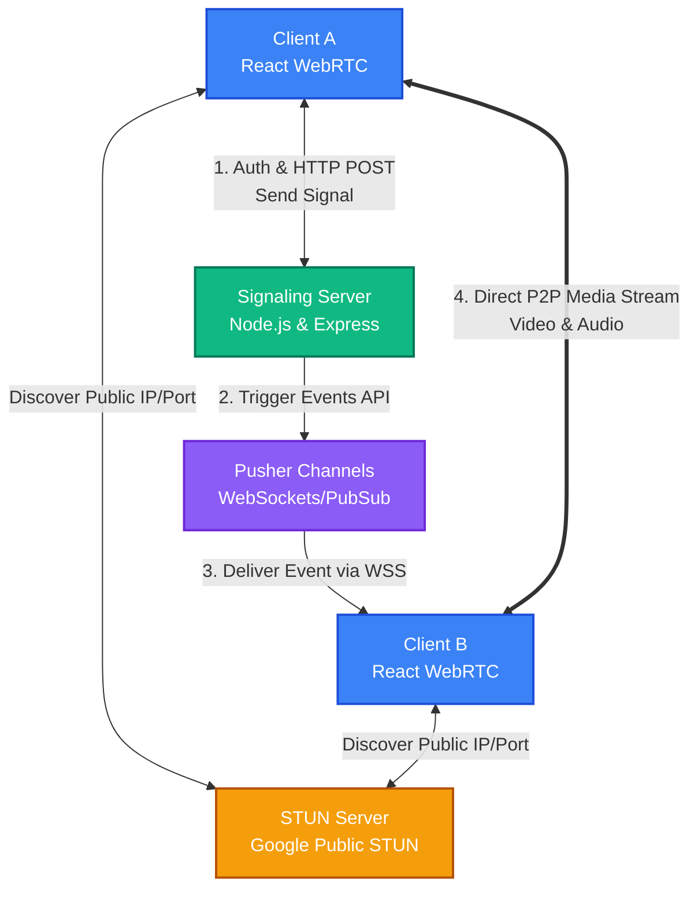

# WebRTC Serverless Signaling Architecture

This repository contains a full-stack WebRTC application featuring a React client and a NodeJS/Express signaling server that has been optimized for serverless/stateless deployment using [Pusher](https://pusher.com/).

## Architecture Overview

Traditional WebRTC signaling relies on stateful WebSocket servers (like Socket.io). This architecture uses **Pusher** to handle the persistent WebSocket connections externally, allowing the backend Signaling Server to remain completely stateless.

## Signaling Flow

1. **Authentication & Discovery**
    - A client connects to the web app and joins a room.
    - It authenticates via the Signaling Server (`/api/pusher/auth`) and connects to a Pusher `presence` channel.
    - Other users in the room are discovered automatically via Pusher presence events.

2. **WebRTC SignalingExchange**
    - When a new participant joins, existing participants generate a WebRTC Offer.
    - They send this Offer using a simple `HTTP POST` to the Signaling Server (`/api/signal`).
    - The server triggers a Pusher event directed at the target user's private channel.
    - The target user receives the Offer, generates an Answer, and sends it back via the same route.
    - ICE candidates are discovered via Google's STUN server and exchanged through the exact same HTTP -> Pusher pipeline.

3. **Peer-to-Peer Connection**
    - Once the SDP (Session Description Protocol) Offers/Answers and ICE candidates are successfully exchanged, a direct Peer-to-Peer (P2P) WebRTC connection is established.
    - Audio and Video streams flow directly between clients without touching the server.

## Project Structure

- `/webrtc_client` - The frontend application (React, Vite, Pusher-JS)
- `/webrtc_server` - The stateless signaling backend (Node.js, Express, Pusher Server SDK)
